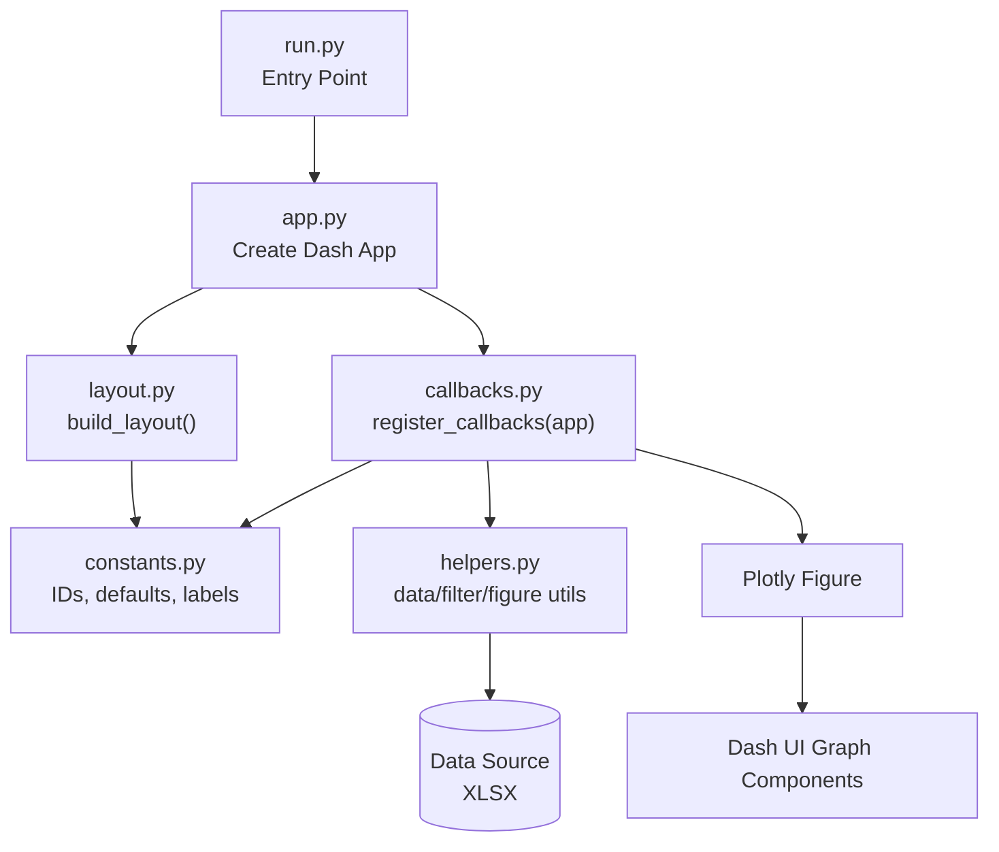

# Attendance Operational Dashboard

This project is a Dash + Plotly dashboard tailored to your prepared attendance dataset.

## Data Source

- Default file: `attendance_merged_evaluated_only.xlsx`
- Default sheet: `attendance`
- Main columns used:
  - grouping/filtering: `academic_year`, `class`, `day`, `exam_attempt`
  - attendance signal: `week_1` ... `week_13`, `total_attendance`
  - outcomes/qa context: `final_grade`, `final_points`

## What the app shows

- Filters for academic year, class, day, exam attempt, and attendance range.
- KPI cards for:
  - unique students in current slice
  - average attendance
  - exam participation rate
  - displayed rows vs total rows
- Focus visualization implemented:
  - correlation between lecture attendance and final grade (`total_attendance` vs `final_grade`)
  - attendance distribution
  - chart type selector for both views: scatter, box, line (average)

## Architecture

- `run.py`: entry point for local run.
- `app.py`: creates Dash app and wires layout + callbacks.
- `layout.py`: dashboard UI and default filter state.
- `callbacks.py`: reactive filtering and chart/KPI updates.
- `helpers.py`: data loading, preprocessing, filtering, metrics, and figure builders.
- `constants.py`: shared component IDs, view keys, and defaults.



## Run locally

1. Check python version (>=3.9):
```bash
python --version
```

2. Make a virtual environment:
```bash
python -m venv venv
source venv/bin/activate (for Unix)
venv\Scripts\activate (for Windows)
```

1. Install dependencies:

```bash
pip install -r requirements.txt
```

2. Start the app:

```bash
python run.py
```

Then open the local Dash URL shown in your terminal.
